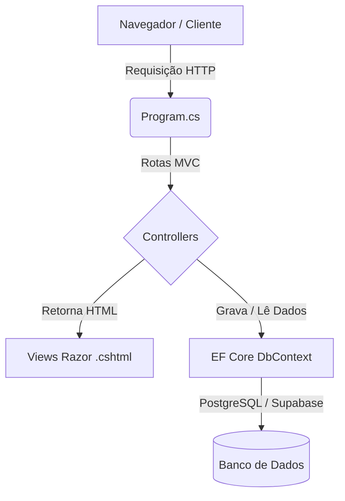

# 🛠️ Triad Suport — G-Lab / SGMA-Web

Uma aplicação moderna desenvolvida em **ASP.NET Core MVC** (.NET 10) para o gerenciamento ágil de Ordens de Serviço (OS) de equipamentos. Permite abrir chamados por Número de Inventário (NI) ou descrição avulsa, delegar responsabilidades, pausar trabalhos e monitorar o tempo líquido real de execução.

---

## 🏗️ Arquitetura do Projeto

O projeto segue a arquitetura **Model-View-Controller (MVC)** clássica estruturada da seguinte forma:



### Estrutura de Pastas
*   📁 **`Controllers`**: Lógica de roteamento e regras de negócio.
    *   `BaseController.cs`: Classe base abstrata que extrai informações de sessão (`UsuarioId`, `UsuarioNome`, `UsuarioPerfil`) e fornece o método utilitário de segurança `ExigirLogin()`.
    *   `LoginController.cs`: Gerenciador de login, logout e memorização de login via cookies.
    *   `OrdensServicoController.cs`: Abertura, listagem, filtragem e designação de técnicos.
    *   `ExecucaoController.cs`: Lógica de transições de status da OS e medição do cronômetro.
*   📁 **`Models`**: Modelagem de dados, DTOs e persistência.
    *   `AppDbContext.cs`: Configuração e mapeamento de relacionamentos do Entity Framework Core.
    *   `DbInitializer.cs`: Gerenciador de seed de dados automatizado em C# na inicialização do aplicativo.
    *   `PasswordHelper.cs`: Mecanismo de hashing seguro de senhas com algoritmo **PBKDF2**.
*   📁 **`Views`**: Templates de interface de usuário Razor (`.cshtml`).
    *   `Views/Shared/_Layout.cshtml`: Layout principal global contendo barras laterais de navegação e cabeçalhos responsivos (mobile/desktop).
*   📁 **`wwwroot`**: Recursos estáticos como imagens, scripts JavaScript, Bootstrap e estilos customizados (`site.css`).

---

## ⚡ Principais Funcionalidades

1.  **Autenticação e Sessão nativa:** login com controle de perfis (*Administrador* e *Colaborador*), cookies opcionais e expiração de sessão após 8 horas de inatividade.
2.  **Gestão de Equipamentos:** Cadastro e edição de ativos com ou sem Número de Inventário (NI) único e histórico completo de ordens de serviço por equipamento no painel de administração.
3.  **Abertura Inteligente de OS:** Permite ao usuário pesquisar NIs com sugestões automáticas via AJAX, prevenindo a abertura de ordens duplicadas em ativos que já possuem chamados em aberto.
4.  **Atribuição com Carga de Trabalho:** Ao delegar um chamado, o painel exibe ao lado de cada técnico quantas ordens de serviço ele já possui em andamento ou pendentes.
5.  **Limitação de Trabalho Concorrente (Regra de Execução):**
    *   Cada técnico só pode possuir **no máximo uma** ordem no status **"Em Execução"** por vez.
    *   Caso tente iniciar uma nova OS sem pausar ou concluir a atual, a ação é bloqueada com mensagem de erro.
    *   Atribuições administrativas ou autoatribuições criadas sob essa condição são convertidas automaticamente para o status **"Pendente"** temporariamente.
6.  **Cronômetro Preciso:** O tempo de trabalho calcula os períodos cumulativos em que a ordem esteve sob execução ativa, desconsiderando intervalos em que a OS esteve em status "Aguardando" (pausada).

---

## 🔑 Credenciais de Teste

Para realizar o login no painel de desenvolvimento, utilize as seguintes contas padrão:

*   **Administrador Geral:** `geral@projeto.local` / senha: `123`
*   **Administrador OPP:** `admin@projeto.local` / senha: `123`
*   **Colaborador João:** `joao@projeto.local` / senha: `123`
*   **Colaboradora Maria:** `maria@projeto.local` / senha: `123`

---

## 🗄️ Inicialização e Seed do Banco de Dados

A aplicação está configurada para conectar-se ao Supabase PostgreSQL através do arquivo `appsettings.Development.json` (ou banco em memória caso a connection string esteja vazia).

### Carga Automática (C#)
Se as tabelas do banco de dados estiverem vazias, o inicializador `DbInitializer.Seed()` preenche a base automaticamente no startup do servidor com:
*   A base de usuários padrão.
*   **8 salas de aula** (`610`, `615`, `603`, `604`, `601`, `602`, `605`, `612`) contendo **163 equipamentos cada** (40 computadores com NIs sequenciais — como os NIs `1248381` a `1248420` da Sala 610 —, 40 teclados, 40 monitores, 40 mouses sem NI, 2 ar-condicionados e 1 projetor).
*   Um conjunto de 15 ordens de serviço realistas estruturadas em diferentes estados.

### Carga Manual (SQL)
Caso prefira redefinir o banco de dados completamente a partir do zero:
1.  Copie o conteúdo do arquivo localizado em [seed-dados-demo.sql](file:///c:/Juan/G-LAB/ProjetoOS/scripts/seed-dados-demo.sql).
2.  Cole-o no editor de consultas SQL do painel do **Supabase** e execute-o.
3.  O script fará um truncate completo nas tabelas e recriará toda a estrutura de salas e chamados de demonstração.

---

## 🚀 Como Executar

Certifique-se de possuir o **.NET SDK 10** instalado em sua máquina.

1.  Restaure as dependências do projeto:
    ```bash
    dotnet restore
    ```
2.  Inicie a aplicação localmente:
    ```bash
    dotnet run
    ```
3.  Abra o navegador no endereço indicado no terminal (por padrão: `http://localhost:5093`).
